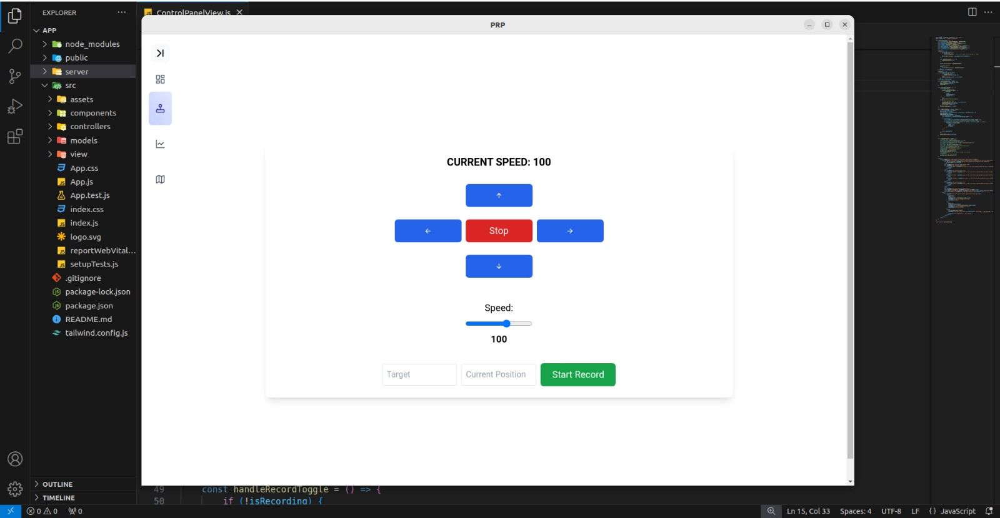
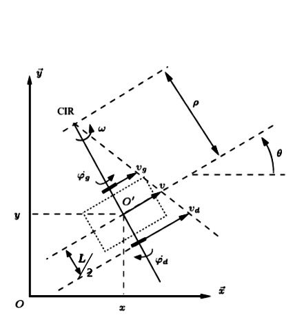
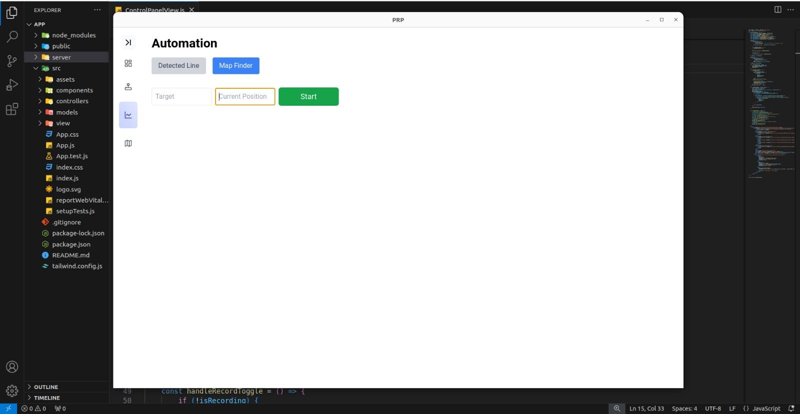
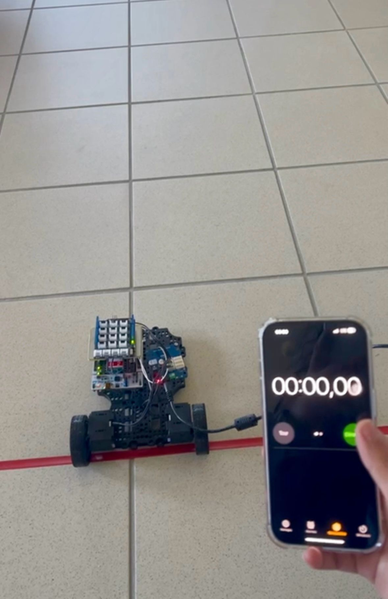

# Contrôle d'un Robot Car Unicycle via une IHM (Interface Homme-Machine)

Ce projet vise à créer une interface utilisateur pour contrôler un robot car unicycle.

## 🤖 Introduction
L'application est construite sur une plateforme STM32, utilisant une liaison Zigbee pour la communication avec le robot. La technologie utilisée pour développer cette interface est basée sur Node.js, Electron.js et Socket.io pour permettre une communication efficace via la liaison Zigbee. Le front-end de l'application est développé en React.js et stylisé avec Tailwind CSS.

## 📋 Fonctionnalités

    Contrôle du mouvement du robot car unicycle.
    Affichage en temps réel de la position du robot.
    Interaction intuitive avec l'IHM via une interface conviviale.

### Images

Below are images showing how the program works:

- **Command Panel**
  

- **Kinematic Model**
  

- **Automation Part**
  

- **Real-Time Test**
  

  
## 🏗️ Architecture du Projet

L'architecture du projet se compose de plusieurs composants principaux :

    STM32 Platform: La plateforme matérielle sur laquelle le robot car unicycle est construit.
    Liaison Zigbee: Utilisée pour la communication sans fil entre l'IHM et le robot.
    Node.js, Electron.js et Socket.io: Utilisés pour développer l'interface utilisateur et permettre une communication efficace avec 
    le robot via la liaison Zigbee.
    React.js: Utilisé pour développer le front-end de l'application, offrant une expérience utilisateur réactive et interactive.
    Tailwind CSS: Utilisé pour styliser l'IHM, fournissant une interface esthétique et moderne.

## 🤝 Contribution

Les contributions sont les bienvenues ! Pour toute modification majeure, veuillez d'abord discuter de votre idée de changement en créant une issue.
✍️ Auteurs

    MAHAMAT Madaï
    Gelis MELACHEU MOMO <g2melach@enib.fr>; 
    Logann MENARD <l2menard@enib.fr>; 

📝 Licence

Ce projet est sous licence MIT.

